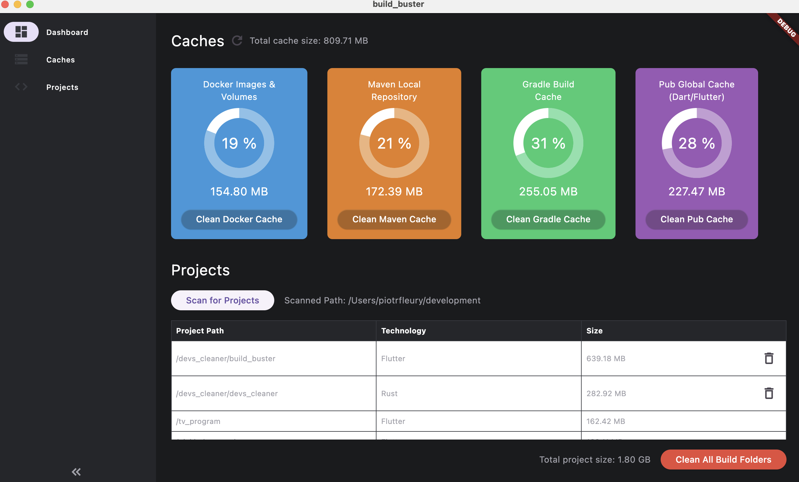

# Devs cleaner

A toolbox to free disk space for developpers

## UI - (Build Buster)

Build Buster is a UI utility focusing on developpers tools disk usage.

See, scan, clean, and voilà !

### Caches

Quickly find disk space usage of each common tools used.

* Docker (images, containers, volumes, networks)

* Maven local repository

* Gradle caches

* Pub cache

* Npm cache

### Projects

Scan any folder containing your dev projects to get a full report of each detected projets and its disk usage

## Server - (Devs cleaner)

The UI utility requires a helper backend to work.

This backend is a simple Rest API built with Rust charged to perform scans and cleanups.
